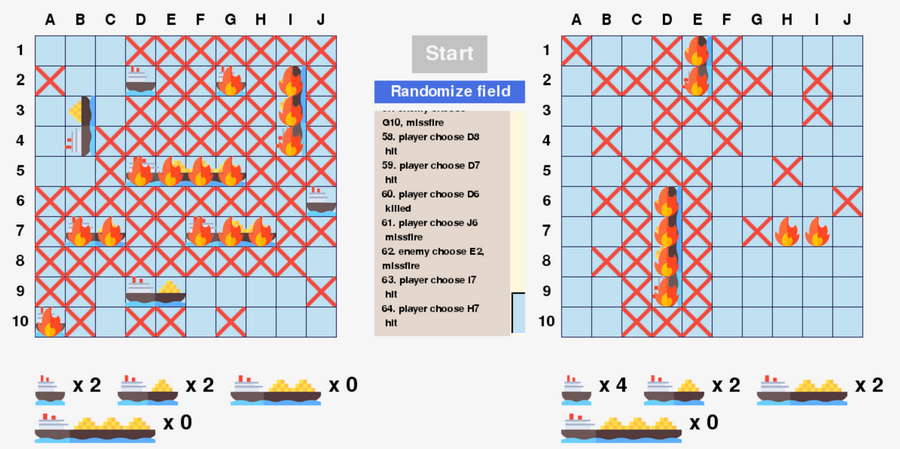

<h1>Battleship</h1>

 <a href = "https://en.wikipedia.org/wiki/Battleship_(game)" title="Battleship wiki">Battleship</a> is the game where you try to sink all of the other player's ships before he sink all of yours. You try and hit them by clicking on one of the squares on the board. The other player also tries to hit your ships by choosing coordinates. Neither you nor the other player can see the other's board so you must try to guess where they are. 

<h1>Requeriments</h1>
<ul>
  <li> <a href="https://www.python.org/">Python</a> 3.x</li>
  <li> <a href="https://www.pygame.org">Pygame</a></li>
  <li> <a href="https://pygame-menu.readthedocs.io/en/latest/">pygame-menu</a></li>
</ul>

<h1>Let's play</h1>
<h2>Clone repository</h2>
        git clone https://github.com/KatsiarynaYab/Battleship.git
        cd Battleship
<h2>Run game</h2>
$ python battleship.py

<h2>Enjoy!</h2>

Icons made by <a href="https://www.flaticon.com/authors/freepik" title="Freepik">Freepik</a> from <a href="https://www.flaticon.com/" title="Flaticon"> www.flaticon.com</a>
